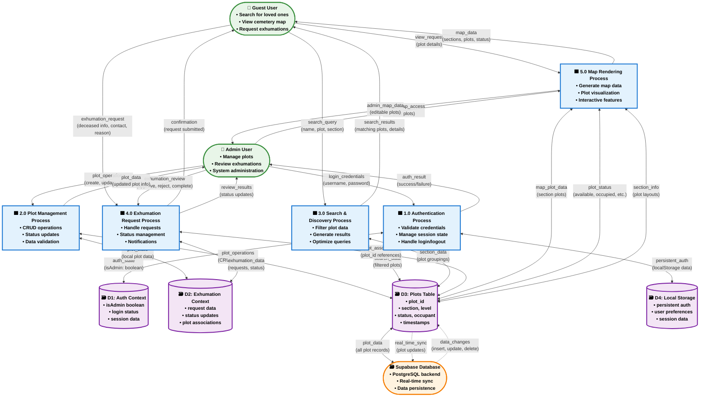
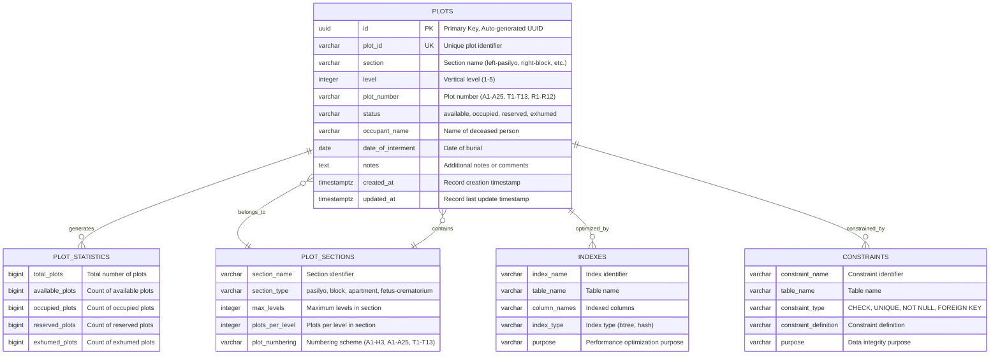
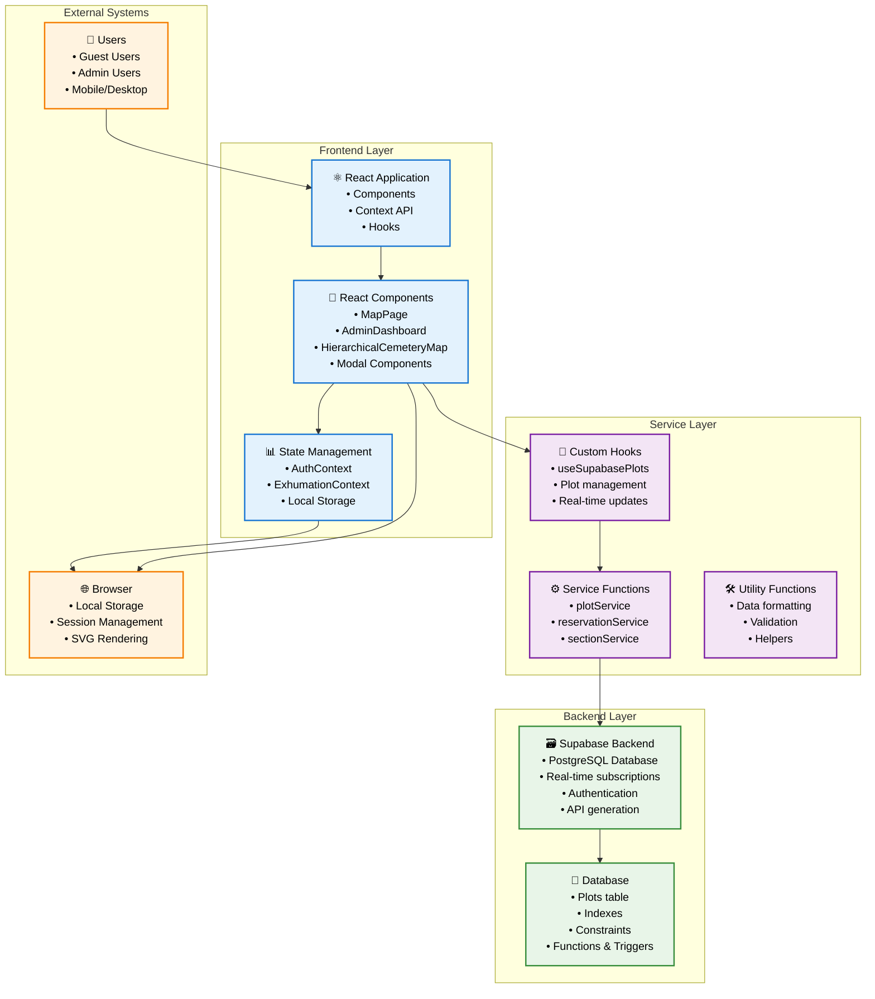

# Cemetery Management System - Comprehensive Visual Diagrams

## Overview
This document contains three comprehensive visual diagrams that document the complete Cemetery Management System architecture, data flows, and database structure.

---

## 1. System Flowchart - User Journey & Process Flow

This flowchart shows the complete user experience for both guest users and administrators, including all decision points and system processes.

```mermaid
flowchart TD
    Start([🏠 User Visits Website]) --> UserType{User Type?}
    
    %% Guest User Flow
    UserType -->|Guest User| HomePage[🏠 Home Page<br/>• View Hero Section<br/>• View Features<br/>• Access Map]
    HomePage --> MapAccess[🗺️ Navigate to Map]
    MapAccess --> MapPage[🗺️ Map Page<br/>• Search Cemetery<br/>• View Interactive Map<br/>• Plot Status Legend]
    
    MapPage --> SearchChoice{Search for Loved One?}
    SearchChoice -->|Yes| SearchInput[🔍 Enter Search Terms<br/>• Name<br/>• Plot Number<br/>• Section]
    SearchChoice -->|No| MapView[🗺️ View Interactive Map]
    
    SearchInput --> SearchProcess[🔍 Search Process<br/>• Filter cemetery data<br/>• Display results<br/>• Show plot details]
    SearchProcess --> SearchResults{Results Found?}
    SearchResults -->|Yes| ViewResults[📋 View Search Results<br/>• Plot details<br/>• Location info<br/>• Status badges]
    SearchResults -->|No| NoResults[❌ No Results Message<br/>• Search suggestions<br/>• Alternative options]
    
    MapView --> SectionClick[🖱️ Click Cemetery Section]
    SectionClick --> SectionView[🏗️ View Section Details<br/>• Plot grid display<br/>• Status legend<br/>• Level selector]
    SectionView --> PlotClick{Click Plot?}
    PlotClick -->|Yes| PlotDetails[📊 View Plot Details<br/>• Occupant info<br/>• Status<br/>• Notes<br/>• Date of interment]
    PlotClick -->|No| SectionView
    
    PlotDetails --> ExhumationDecision{Request Exhumation?}
    ExhumationDecision -->|Yes| ExhumationModal[📝 Exhumation Request Modal<br/>• Fill form<br/>• Deceased info<br/>• Next of kin<br/>• Contact details<br/>• Reason for request]
    ExhumationDecision -->|No| SectionView
    
    ExhumationModal --> ExhumationSubmit[✅ Submit Request<br/>• Store in context<br/>• Show confirmation<br/>• Send notification]
    ExhumationSubmit --> EndGuest([✅ Guest Session Complete])
    
    %% Admin User Flow
    UserType -->|Admin User| AdminLogin[🔐 Admin Login<br/>• Username: admin<br/>• Password: admin123]
    AdminLogin --> AuthCheck{Valid Credentials?}
    AuthCheck -->|No| LoginError[❌ Login Error<br/>• Invalid credentials<br/>• Retry option]
    AuthCheck -->|Yes| AuthSuccess[✅ Authentication Success<br/>• Set isAdmin: true<br/>• Store in localStorage<br/>• Grant admin access]
    
    LoginError --> AdminLogin
    AuthSuccess --> AdminDashboard[🏢 Admin Dashboard<br/>• View statistics<br/>• Manage plots<br/>• Review exhumations<br/>• System overview]
    
    AdminDashboard --> AdminAction{Admin Action?}
    AdminAction -->|Manage Plots| PlotManagement[🏗️ Plot Management<br/>• Add new plots<br/>• Edit existing plots<br/>• Delete plots<br/>• Update plot status<br/>• CRUD operations]
    AdminAction -->|Review Exhumations| ExhumationManagement[📋 Exhumation Management<br/>• View pending requests<br/>• Approve/reject requests<br/>• Update status<br/>• Add notes<br/>• Schedule exhumations]
    AdminAction -->|View Map| AdminMapView[🗺️ Admin Map View<br/>• Interactive map<br/>• Click to edit plots<br/>• Real-time updates]
    
    PlotManagement --> PlotAction{Plot Action?}
    PlotAction -->|Add Plot| AddPlotModal[➕ Add Plot Modal<br/>• Select section/level<br/>• Enter plot details<br/>• Set initial status<br/>• Save to database]
    PlotAction -->|Edit Plot| EditPlotModal[✏️ Edit Plot Modal<br/>• Update occupant info<br/>• Change status<br/>• Modify notes<br/>• Save changes]
    PlotAction -->|Delete Plot| DeleteConfirm{Confirm Deletion?}
    
    AddPlotModal --> SupabaseCreate[💾 Create Plot in Supabase<br/>• Insert new record<br/>• Update local state<br/>• Sync with database]
    EditPlotModal --> SupabaseUpdate[💾 Update Plot in Supabase<br/>• Modify existing record<br/>• Update local state<br/>• Real-time sync]
    DeleteConfirm -->|Yes| SupabaseDelete[🗑️ Delete Plot from Supabase<br/>• Remove record<br/>• Update local state<br/>• Clean up references]
    DeleteConfirm -->|No| PlotManagement
    
    SupabaseCreate --> PlotManagement
    SupabaseUpdate --> PlotManagement
    SupabaseDelete --> PlotManagement
    
    ExhumationManagement --> ExhumationAction{Exhumation Action?}
    ExhumationAction -->|Approve| ApproveRequest[✅ Approve Request<br/>• Change status to approved<br/>• Set exhumation date<br/>• Assign team<br/>• Send notification]
    ExhumationAction -->|Reject| RejectRequest[❌ Reject Request<br/>• Change status to rejected<br/>• Add rejection notes<br/>• Notify requester]
    ExhumationAction -->|Complete| CompleteExhumation[🏁 Mark Complete<br/>• Change status to completed<br/>• Update plot status<br/>• Finalize process]
    
    ApproveRequest --> UpdateExhumationStatus[🔄 Update Exhumation Status<br/>• Modify context state<br/>• Update display<br/>• Sync changes]
    RejectRequest --> UpdateExhumationStatus
    CompleteExhumation --> UpdateExhumationStatus
    UpdateExhumationStatus --> ExhumationManagement
    
    AdminMapView --> AdminSectionClick[🖱️ Click Section (Admin)]
    AdminSectionClick --> AdminSectionView[🏗️ Admin Section View<br/>• Edit plot capabilities<br/>• Status management<br/>• Quick actions]
    AdminSectionView --> AdminPlotClick{Click Plot (Admin)?}
    AdminPlotClick -->|Yes| AdminPlotEdit[✏️ Edit Plot Details<br/>• Open edit modal<br/>• Modify plot data<br/>• Save changes]
    AdminPlotClick -->|No| AdminSectionView
    
    AdminPlotEdit --> PlotAction
    
    %% Logout Flow
    AdminDashboard --> LogoutDecision{Logout?}
    LogoutDecision -->|Yes| LogoutProcess[🚪 Logout Process<br/>• Clear localStorage<br/>• Reset isAdmin: false<br/>• Redirect to home<br/>• End session]
    LogoutDecision -->|No| AdminAction
    
    LogoutProcess --> EndAdmin([✅ Admin Session Complete])
    
    %% Common End Points
    NoResults --> MapView
    ViewResults --> MapView
    
    %% Styling
    classDef processBox fill:#e3f2fd,stroke:#1976d2,stroke-width:3px,color:#000,font-weight:bold
    classDef decisionBox fill:#fff3e0,stroke:#f57c00,stroke-width:3px,color:#000,font-weight:bold
    classDef startEndBox fill:#e8f5e8,stroke:#388e3c,stroke-width:3px,color:#000,font-weight:bold
    classDef errorBox fill:#ffebee,stroke:#d32f2f,stroke-width:3px,color:#000,font-weight:bold
    classDef databaseBox fill:#f3e5f5,stroke:#7b1fa2,stroke-width:3px,color:#000,font-weight:bold
    
    class HomePage,MapAccess,MapPage,SearchInput,SearchProcess,SectionClick,SectionView,PlotDetails,ExhumationModal,ExhumationSubmit,AdminLogin,AuthSuccess,AdminDashboard,PlotManagement,ExhumationManagement,AdminMapView,AddPlotModal,EditPlotModal,SupabaseCreate,SupabaseUpdate,SupabaseDelete,ApproveRequest,RejectRequest,CompleteExhumation,UpdateExhumationStatus,AdminSectionClick,AdminSectionView,AdminPlotEdit,LogoutProcess processBox
    
    class UserType,SearchChoice,SearchResults,PlotClick,ExhumationDecision,AuthCheck,AdminAction,PlotAction,DeleteConfirm,ExhumationAction,AdminPlotClick,LogoutDecision decisionBox
    
    class Start,EndGuest,EndAdmin startEndBox
    
    class LoginError,NoResults,ViewResults errorBox
    
    class SupabaseCreate,SupabaseUpdate,SupabaseDelete databaseBox
```

---

## 2. Data Flow Diagram - System Architecture & Data Movement

This Level 1 Data Flow Diagram shows how data moves through the Cemetery Management System between processes, data stores, and external entities.



---

## 3. Database Diagram - Entity Relationship & Schema

This Entity-Relationship Diagram shows the complete database schema including the main plots table, supporting structures, and relationships.



---

## 4. System Architecture Overview

This diagram shows the high-level system architecture and technology stack.



---

## 5. Cemetery Section Structure

This diagram illustrates the hierarchical organization of the cemetery sections and plots.

    

## Legend & Symbols

### Process Types
- 🟦 **Main Process**: Core system functionality
- 🗃️ **Data Store**: Persistent data storage
- 👤 **External Entity**: Users or external systems
- ➡️ **Data Flow**: Data movement direction

### Status Indicators
- 🟢 **Available**: Plot is open for new burials
- 🔴 **Occupied**: Plot contains remains
- 🟡 **Reserved**: Plot is reserved for future use
- 🟣 **Exhumed**: Plot was occupied but remains were removed

### User Types
- 👤 **Guest User**: Public access, search and view only
- 👨‍💼 **Admin User**: Full system access, CRUD operations

### Technology Stack
- ⚛️ **React**: Frontend framework
- 🗃️ **Supabase**: Backend as a Service
- 💾 **PostgreSQL**: Database engine
- 🌐 **Browser**: Client environment

---

## Summary

These comprehensive diagrams provide a complete visual documentation of the Cemetery Management System:

1. **System Flowchart**: Shows complete user journeys and decision points
2. **Data Flow Diagram**: Illustrates system architecture and data movement
3. **Database Diagram**: Details the database schema and relationships
4. **System Architecture**: High-level technology stack overview
5. **Cemetery Structure**: Hierarchical organization of sections and plots

Each diagram uses professional symbols, clear labeling, and comprehensive coverage of the system components to provide complete visual documentation of the Cemetery Management System.


