# Data Flow Diagram - Cemetery Management System

## Overview
This Level 1 Data Flow Diagram (DFD) shows how data moves through the Cemetery Management System. It illustrates the processes, data stores, external entities, and data flows that make up the system architecture.

## Legend
- 🟦 **Process**: System processes that transform data
- 🗃️ **Data Store**: Persistent storage locations
- 👤 **External Entity**: Users or external systems
- ➡️ **Data Flow**: Movement of data between components

## Data Flow Diagram

```mermaid
flowchart TD
    %% External Entities
    GuestUser([👤 Guest User])
    AdminUser([👤 Admin User])
    SupabaseDB([🗃️ Supabase Database])
    
    %% Main Processes
    AuthProcess[🟦 1.0<br/>Authentication<br/>Process]
    PlotManagement[🟦 2.0<br/>Plot Management<br/>Process]
    SearchProcess[🟦 3.0<br/>Search & Discovery<br/>Process]
    ExhumationProcess[🟦 4.0<br/>Exhumation Request<br/>Process]
    MapRendering[🟦 5.0<br/>Map Rendering<br/>Process]
    
    %% Data Stores
    AuthStore[(🗃️ D1: Auth Context<br/>isAdmin, login status)]
    ExhumationStore[(🗃️ D2: Exhumation Context<br/>requests, status)]
    PlotStore[(🗃️ D3: Plots Table<br/>plot_id, section, level<br/>status, occupant_name<br/>date_of_interment, notes)]
    LocalStorage[(🗃️ D4: Local Storage<br/>persistent auth state)]
    
    %% Guest User Flows
    GuestUser -->|"search_query<br/>(name, plot, section)"| SearchProcess
    GuestUser -->|"view_request<br/>(plot details)"| MapRendering
    GuestUser -->|"exhumation_request<br/>(deceased info, next_of_kin<br/>contact, reason)"| ExhumationProcess
    
    SearchProcess -->|"search_results<br/>(matching plots)"| GuestUser
    MapRendering -->|"map_data<br/>(sections, plots, status)"| GuestUser
    ExhumationProcess -->|"confirmation<br/>(request submitted)"| GuestUser
    
    %% Admin User Flows
    AdminUser -->|"login_credentials<br/>(username, password)"| AuthProcess
    AdminUser -->|"plot_operations<br/>(create, update, delete)"| PlotManagement
    AdminUser -->|"exhumation_review<br/>(approve, reject, complete)"| ExhumationProcess
    AdminUser -->|"admin_map_access<br/>(edit plots)"| MapRendering
    
    AuthProcess -->|"auth_result<br/>(success/failure)"| AdminUser
    PlotManagement -->|"plot_data<br/>(updated plot info)"| AdminUser
    ExhumationProcess -->|"review_results<br/>(status updates)"| AdminUser
    MapRendering -->|"admin_map_data<br/>(editable plots)"| AdminUser
    
    %% Authentication Data Flows
    AuthProcess <-->|"auth_state<br/>(isAdmin: boolean)"| AuthStore
    AuthProcess <-->|"persistent_auth<br/>(localStorage data)"| LocalStorage
    
    %% Plot Management Data Flows
    PlotManagement <-->|"plot_operations<br/>(CRUD operations)"| PlotStore
    PlotStore <-->|"plot_data<br/>(all plot records)"| SupabaseDB
    PlotManagement <-->|"plot_state<br/>(local plot data)"| ExhumationStore
    
    %% Search Process Data Flows
    SearchProcess <-->|"search_data<br/>(filtered plots)"| PlotStore
    SearchProcess <-->|"section_data<br/>(plot groupings)"| PlotStore
    
    %% Exhumation Process Data Flows
    ExhumationProcess <-->|"exhumation_data<br/>(requests, status)"| ExhumationStore
    ExhumationProcess <-->|"plot_association<br/>(plot_id references)"| PlotStore
    
    %% Map Rendering Data Flows
    MapRendering <-->|"map_plot_data<br/>(section plots)"| PlotStore
    MapRendering <-->|"plot_status<br/>(available, occupied, etc.)"| PlotStore
    MapRendering <-->|"section_info<br/>(plot layouts)"| PlotStore
    
    %% External Database Connections
    PlotStore -.->|"real_time_sync<br/>(plot updates)"| SupabaseDB
    SupabaseDB -.->|"data_changes<br/>(insert, update, delete)"| PlotStore
    
    %% Styling
    classDef processBox fill:#e3f2fd,stroke:#1976d2,stroke-width:3px,color:#000
    classDef dataStoreBox fill:#f3e5f5,stroke:#7b1fa2,stroke-width:2px,color:#000
    classDef externalBox fill:#e8f5e8,stroke:#388e3c,stroke-width:2px,color:#000
    classDef flowLabel fill:#fff,stroke:#666,stroke-width:1px,color:#000,font-size:10px
    
    class AuthProcess,PlotManagement,SearchProcess,ExhumationProcess,MapRendering processBox
    class AuthStore,ExhumationStore,PlotStore,LocalStorage dataStoreBox
    class GuestUser,AdminUser,SupabaseDB externalBox
```

## Detailed Process Descriptions

### 1.0 Authentication Process
- **Input**: Login credentials from Admin User
- **Output**: Authentication status to AuthStore and Admin User
- **Function**: Validates admin credentials and manages session state
- **Data Flows**:
  - `login_credentials` → Process → `auth_state`
  - `persistent_auth` ↔ LocalStorage

### 2.0 Plot Management Process
- **Input**: Plot operations from Admin User
- **Output**: Updated plot data to PlotStore
- **Function**: Handles CRUD operations for cemetery plots
- **Data Flows**:
  - `plot_operations` → Process → `plot_operations` → PlotStore
  - PlotStore ↔ SupabaseDB for persistence

### 3.0 Search & Discovery Process
- **Input**: Search queries from Guest User
- **Output**: Filtered search results
- **Function**: Searches plot data by name, plot number, or section
- **Data Flows**:
  - `search_query` → Process → `search_data` ↔ PlotStore
  - `search_results` → Guest User

### 4.0 Exhumation Request Process
- **Input**: Exhumation requests from Guest User, reviews from Admin User
- **Output**: Request confirmations and status updates
- **Function**: Manages exhumation request lifecycle
- **Data Flows**:
  - `exhumation_request` → Process → `exhumation_data` ↔ ExhumationStore
  - `exhumation_review` → Process → `review_results` → Admin User

### 5.0 Map Rendering Process
- **Input**: Map view requests from both user types
- **Output**: Interactive map data with plot information
- **Function**: Renders cemetery sections and plot details
- **Data Flows**:
  - `view_request` → Process → `map_plot_data` ↔ PlotStore
  - `map_data` → Guest User, `admin_map_data` → Admin User

## Data Store Details

### D1: Auth Context
- **Contents**: `isAdmin` boolean, login status
- **Access**: Read/Write by Authentication Process
- **Persistence**: Session-based, backed by LocalStorage

### D2: Exhumation Context
- **Contents**: Exhumation requests, status updates, plot associations
- **Access**: Read/Write by Exhumation Process
- **Persistence**: In-memory, React Context state

### D3: Plots Table
- **Contents**: All cemetery plot data (ID, section, level, status, occupant info)
- **Access**: Read/Write by Plot Management, Search, and Map Rendering processes
- **Persistence**: Supabase PostgreSQL database

### D4: Local Storage
- **Contents**: Persistent authentication state
- **Access**: Write by Authentication Process
- **Persistence**: Browser local storage

## Key Data Flow Patterns

1. **Real-time Synchronization**: PlotStore maintains sync with SupabaseDB
2. **Context-based State**: ExhumationStore uses React Context for temporary data
3. **Authentication Persistence**: AuthStore backed by LocalStorage for session continuity
4. **Search Optimization**: SearchProcess filters PlotStore data client-side for performance
5. **Admin Authorization**: All admin operations require valid AuthStore state

