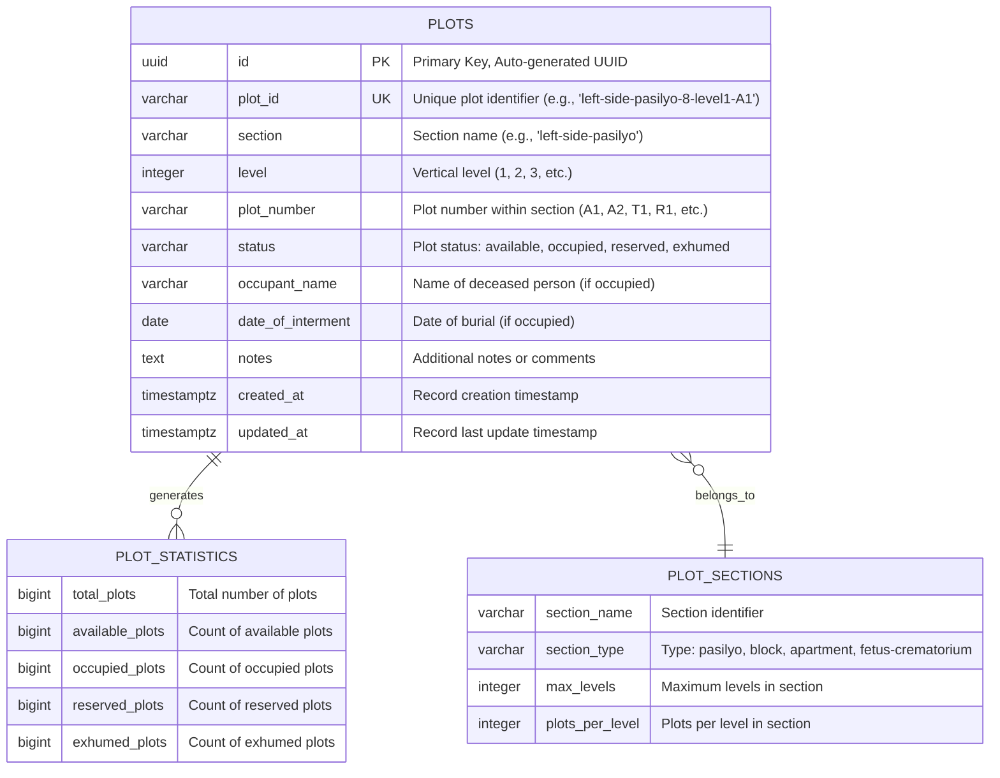

# Database Diagram - Cemetery Management System

## Overview
This Entity-Relationship Diagram (ERD) shows the database schema for the Cemetery Management System. The system currently uses a single main table (`plots`) with additional supporting structures for indexing and constraints.

## Database Technology
- **Database**: PostgreSQL (via Supabase)
- **Extensions**: UUID-OSSP for UUID generation
- **Indexing**: Optimized for common query patterns
- **Constraints**: Data integrity and validation rules

## Database Schema Diagram



## Table Structure Details

### PLOTS Table
The main entity storing all cemetery plot information.

#### Primary Key
- **id**: UUID (Primary Key)
  - Type: `uuid`
  - Default: `uuid_generate_v4()`
  - Purpose: Unique identifier for each plot record

#### Business Keys
- **plot_id**: VARCHAR(100) (Unique Key)
  - Format: `{section}-level{level}-{plot_number}`
  - Examples: 
    - `left-side-pasilyo-8-level1-A1`
    - `apartment-5-level1-A25`
    - `fetus-crematorium-top-T13`
  - Purpose: Human-readable unique plot identifier

#### Location Attributes
- **section**: VARCHAR(50)
  - Values: `left-side-pasilyo`, `right-side-pasilyo`, `left-block`, `right-block`, `apartment`, `fetus-crematorium`
  - Purpose: Groups plots by cemetery section

- **level**: INTEGER
  - Range: 1-5 (varies by section type)
  - Purpose: Vertical stacking level within section

- **plot_number**: VARCHAR(20)
  - Format: `A1-A8` (regular), `A1-A25` (apartment), `T1-T13` (top), `R1-R12` (side)
  - Purpose: Position within section/level

#### Status and Occupancy
- **status**: VARCHAR(20)
  - Constraint: `CHECK (status IN ('available', 'occupied', 'reserved', 'exhumed'))`
  - Purpose: Current state of the plot

- **occupant_name**: VARCHAR(255)
  - Default: Empty string
  - Purpose: Name of deceased person (if occupied)

- **date_of_interment**: DATE
  - Default: NULL
  - Purpose: Date of burial (if occupied)

#### Metadata
- **notes**: TEXT
  - Default: Empty string
  - Purpose: Additional information about the plot

- **created_at**: TIMESTAMPTZ
  - Default: `NOW()`
  - Purpose: Record creation timestamp

- **updated_at**: TIMESTAMPTZ
  - Default: `NOW()`
  - Purpose: Last modification timestamp

## Indexes and Performance

### Primary Indexes
```sql
-- Section-based queries
CREATE INDEX idx_plots_section ON plots(section);

-- Level-based queries  
CREATE INDEX idx_plots_level ON plots(level);

-- Status filtering
CREATE INDEX idx_plots_status ON plots(status);

-- Composite section+level queries
CREATE INDEX idx_plots_section_level ON plots(section, level);
```

### Query Optimization
- **Section Browsing**: `idx_plots_section` enables fast section-based filtering
- **Level Navigation**: `idx_plots_level` supports level-specific queries
- **Status Filtering**: `idx_plots_status` optimizes status-based searches
- **Hierarchical Queries**: `idx_plots_section_level` supports section+level combinations

## Database Functions

### 1. Update Timestamp Trigger
```sql
CREATE OR REPLACE FUNCTION update_updated_at_column()
RETURNS TRIGGER AS $$
BEGIN
    NEW.updated_at = NOW();
    RETURN NEW;
END;
$$ language 'plpgsql';

CREATE TRIGGER update_plots_updated_at 
    BEFORE UPDATE ON plots 
    FOR EACH ROW 
    EXECUTE FUNCTION update_updated_at_column();
```

### 2. Section and Level Queries
```sql
CREATE OR REPLACE FUNCTION get_plots_by_section_and_level(
  section_name VARCHAR(50),
  level_num INTEGER DEFAULT NULL
)
RETURNS TABLE (...)
```

### 3. Statistics Aggregation
```sql
CREATE OR REPLACE FUNCTION get_plot_statistics()
RETURNS TABLE (
  total_plots BIGINT,
  available_plots BIGINT,
  occupied_plots BIGINT,
  reserved_plots BIGINT,
  exhumed_plots BIGINT
)
```

## Sample Data Structure

### Cemetery Section Types
1. **Pasilyo Sections** (Left/Right)
   - 28 sections each (left-pasilyo-1 to left-pasilyo-28)
   - 3 levels per section
   - 8 plots per level (A1-H1, A2-H2, A3-H3)

2. **Block Sections** (Left/Right)
   - 10 sections each (left-block-1 to left-block-10)
   - 3 levels per section
   - 8 plots per level (A1-H1, A2-H2, A3-H3)

3. **Apartment Sections**
   - 5 main sections (apartment-1 to apartment-5)
   - 5 levels per section
   - 25 plots per level (A1-A25)

4. **Fetus-Crematorium**
   - 1 section (fetus-crematorium)
   - 1 level
   - 25 plots total (T1-T13, R1-R12)

### Status Values
- **available**: Plot is open for new burials
- **occupied**: Plot contains remains
- **reserved**: Plot is reserved for future use
- **exhumed**: Plot was occupied but remains were removed

## Data Integrity Constraints

### Check Constraints
```sql
ALTER TABLE plots 
ADD CONSTRAINT plots_status_check 
CHECK (status IN ('available', 'occupied', 'reserved', 'exhumed'));
```

### Unique Constraints
```sql
ALTER TABLE plots 
ADD CONSTRAINT plots_plot_id_unique 
UNIQUE (plot_id);
```

### Not Null Constraints
- `id`, `plot_id`, `section`, `level`, `plot_number` are required
- `status` defaults to 'available'
- `occupant_name` and `notes` default to empty strings
- `date_of_interment` can be NULL for unoccupied plots

## Integration Points

### Supabase Integration
- **Real-time Updates**: PostgreSQL triggers for automatic timestamp updates
- **Row Level Security**: Configurable access control
- **API Generation**: Automatic REST API from schema
- **Real-time Subscriptions**: Live data synchronization

### Application Integration
- **useSupabasePlots Hook**: React hook for database operations
- **plotService**: Service layer for CRUD operations
- **Context State**: React Context for temporary data management
- **Local Storage**: Browser persistence for authentication state


