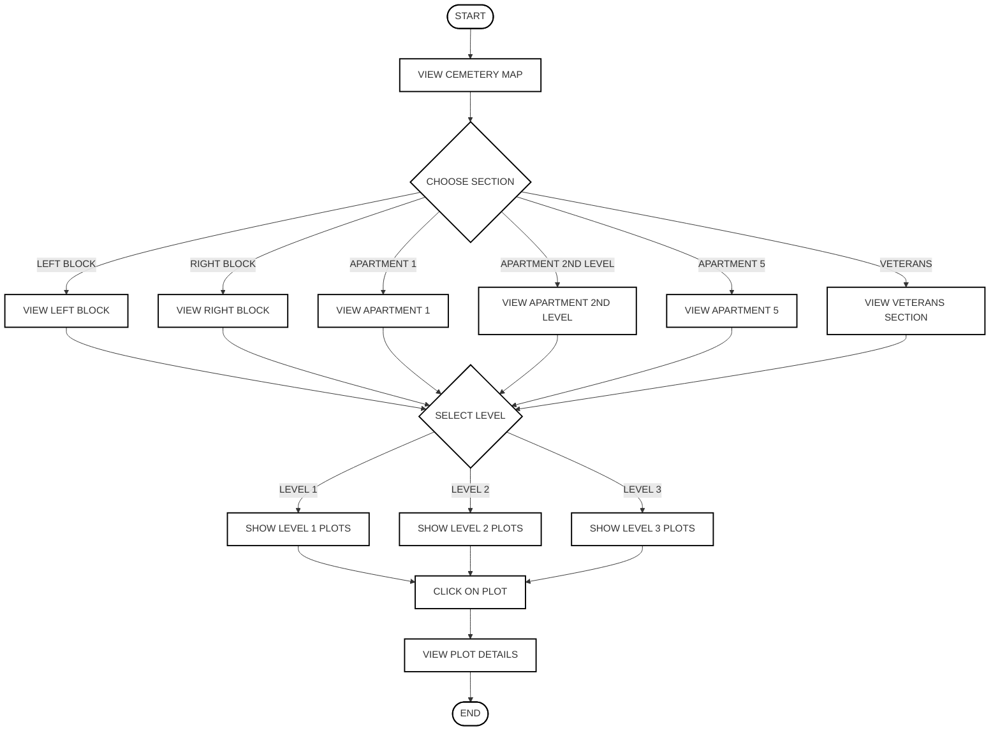
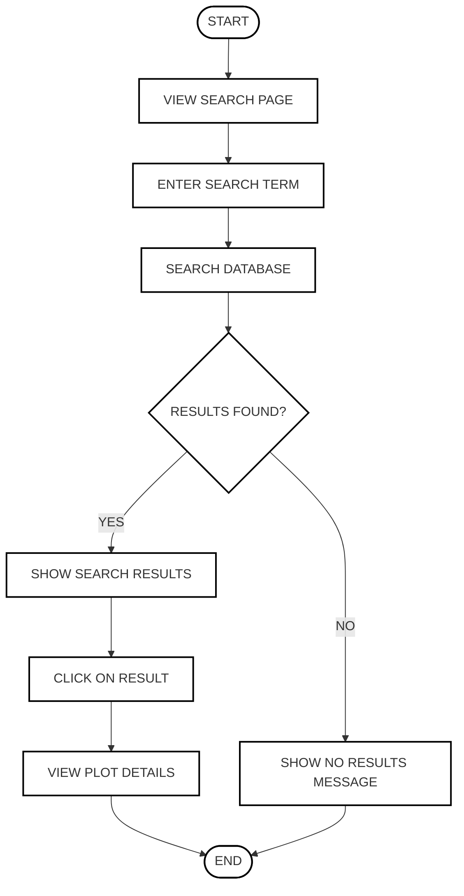
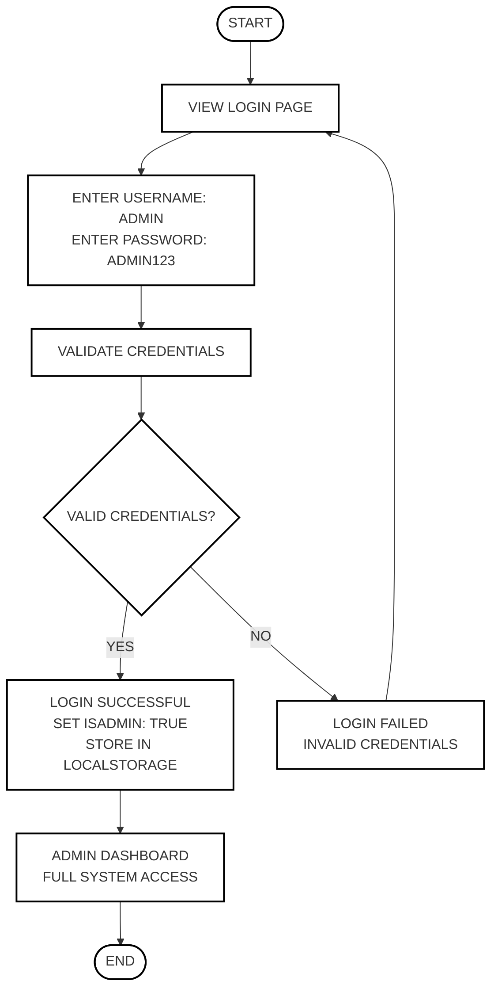
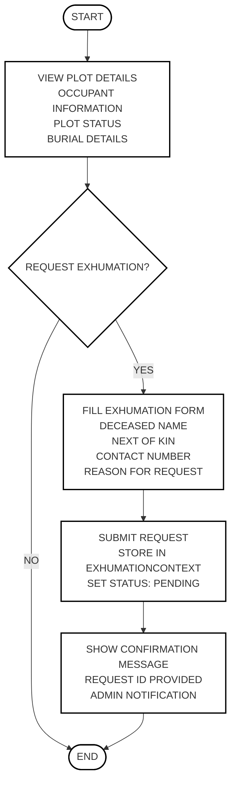
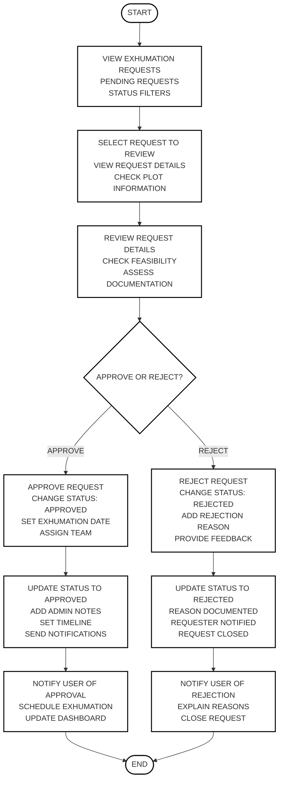
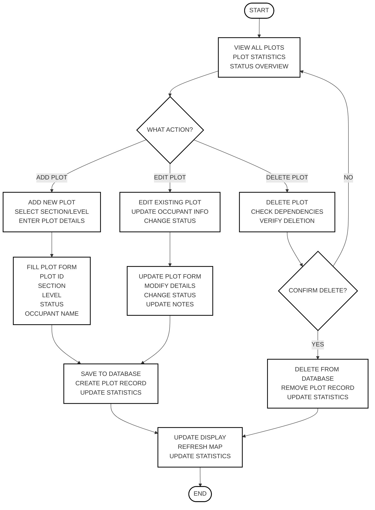
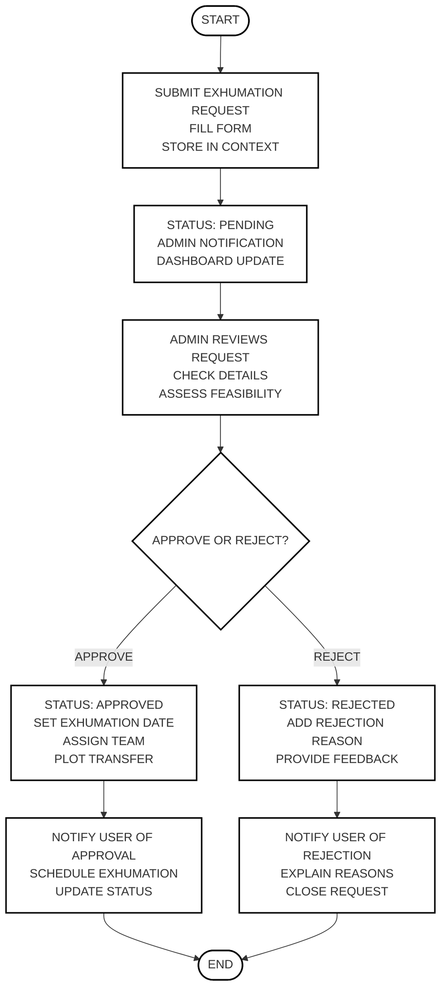
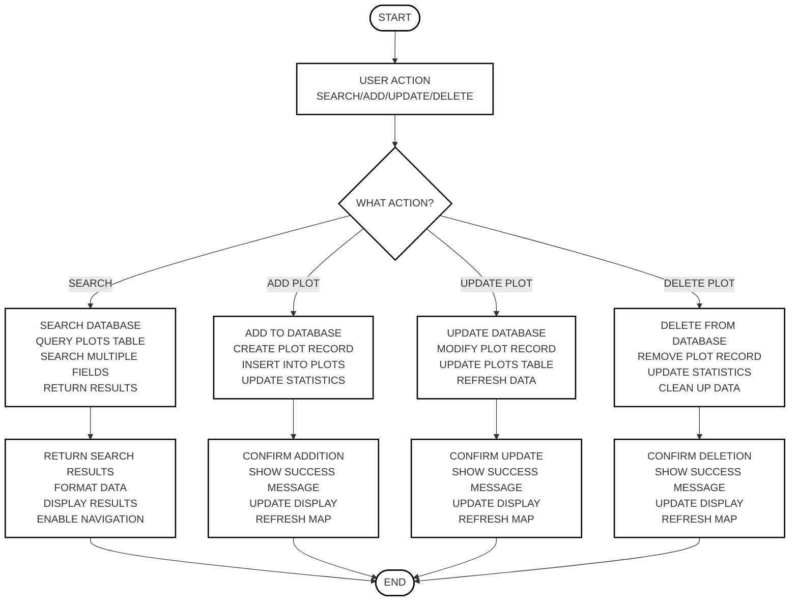

# Simple Clean Flowcharts - Cemetery Management System

## Description
Simple, clean flowcharts following the style of the examples provided. Each flowchart focuses on one specific process with clear steps and minimal complexity.

## How to Use
1. Copy the Mermaid code below each flowchart
2. Go to https://mermaid.live
3. Paste the code into the editor
4. The diagram will render automatically
5. You can export as PNG, SVG, or PDF

---

## 1. 🗺️ USER MAP NAVIGATION FLOWCHART

### Description
This flowchart shows how users navigate the cemetery map to find specific plots.

### Mermaid Code

---

## 2. 🔍 SEARCH PROCESS FLOWCHART

### Description
This flowchart shows how users search for loved ones in the cemetery.

### Mermaid Code

---

## 3. 🔐 ADMIN LOGIN FLOWCHART

### Description
This flowchart shows the admin authentication process.

### Mermaid Code

---

## 4. 📝 EXHUMATION REQUEST FLOWCHART

### Description
This flowchart shows how users submit exhumation requests.

### Mermaid Code

---

## 5. 📋 ADMIN EXHUMATION APPROVAL FLOWCHART

### Description
This flowchart shows how admin approves exhumation requests.

### Mermaid Code

---

## 6. 🏗️ ADMIN PLOT MANAGEMENT FLOWCHART

### Description
This flowchart shows how admin manages cemetery plots.

### Mermaid Code

---

## 7. 🔄 EXHUMATION REQUEST STATUS FLOWCHART

### Description
This flowchart shows the lifecycle of an exhumation request.

### Mermaid Code

---

## 8. 🗃️ DATABASE OPERATIONS FLOWCHART

### Description
This flowchart shows how the system interacts with the database.

### Mermaid Code

---

## Summary

### 🎯 **Simple Clean Flowcharts Created:**

1. **🗺️ User Map Navigation** - How users browse cemetery sections
2. **🔍 Search Process** - How users search for loved ones
3. **🔐 Admin Login** - Simple authentication flow
4. **📝 Exhumation Request** - How users submit requests
5. **📋 Admin Exhumation Approval** - How admin reviews requests
6. **🏗️ Admin Plot Management** - How admin manages plots
7. **🔄 Exhumation Request Status** - Request lifecycle
8. **🗃️ Database Operations** - System-database interactions

### ✨ **Key Features:**
- **Simple Steps** - Only essential actions shown
- **Clear Decisions** - Easy to follow choices
- **Clean Design** - Minimal visual clutter
- **Standard Symbols** - Ovals for start/end, rectangles for processes, diamonds for decisions
- **Ready to Use** - Copy and paste into Mermaid Live Editor

Each flowchart follows the same clean, simple style as the examples provided, focusing on one specific process with clear, easy-to-follow steps.

