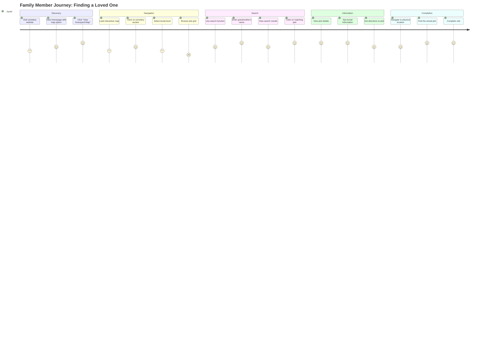
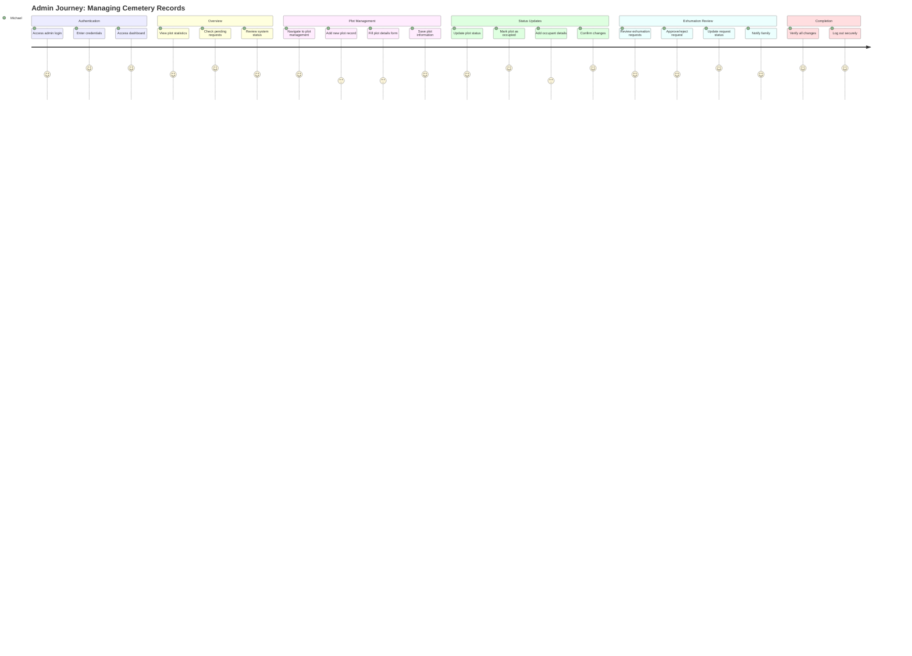
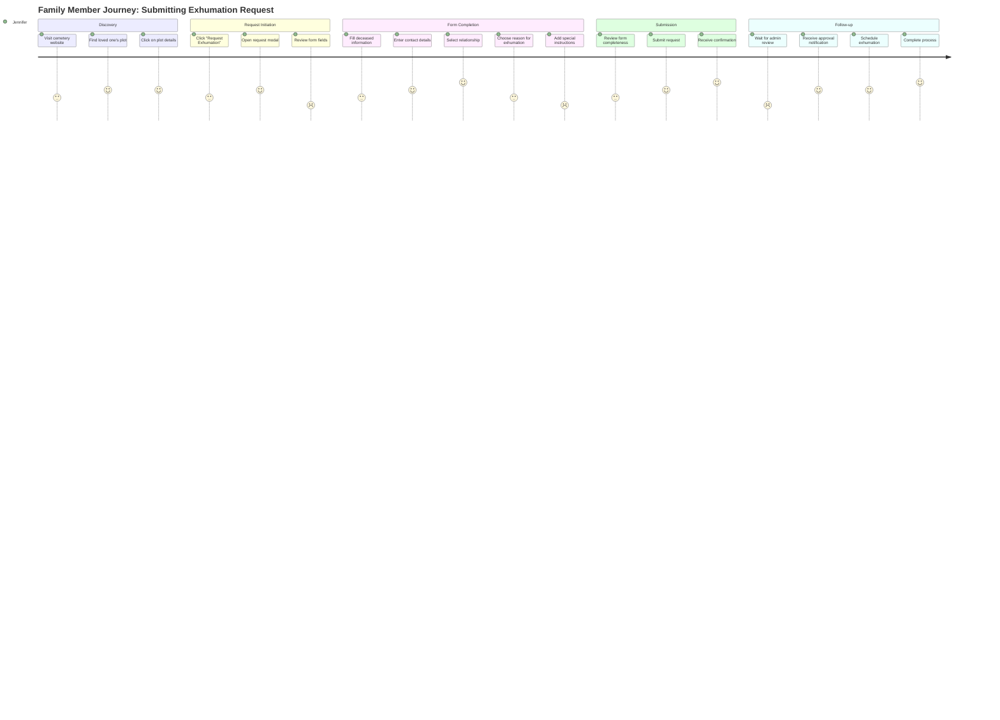
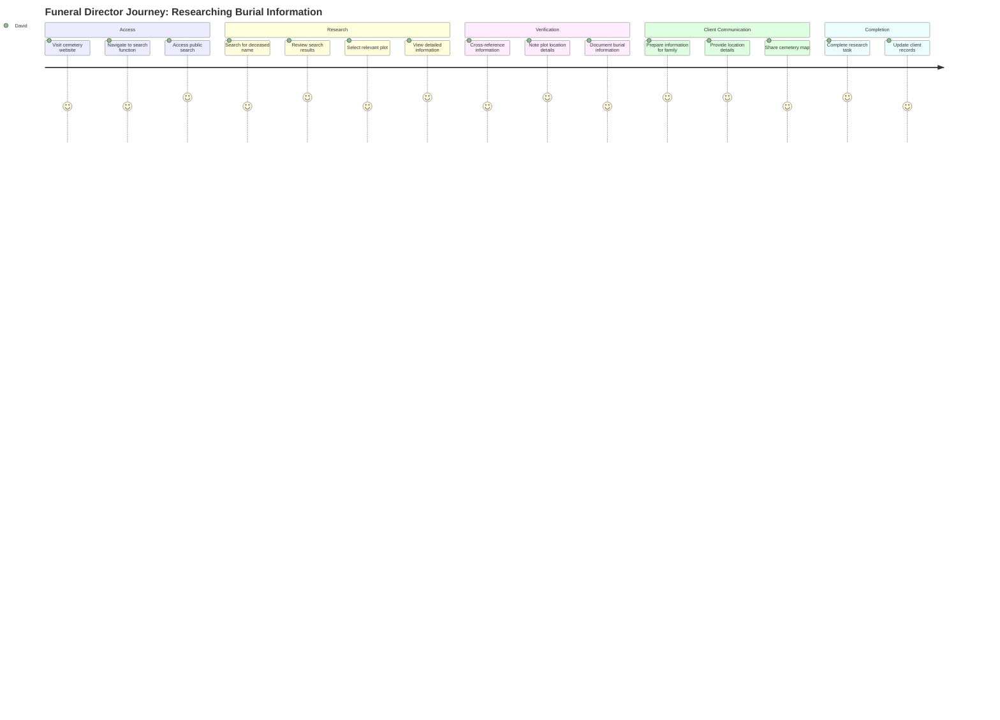
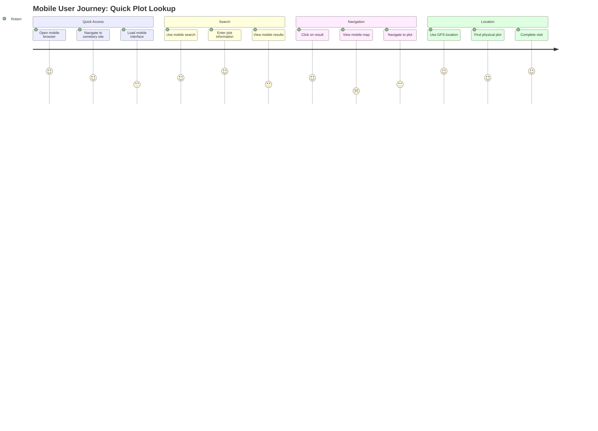

# User Journey Maps - Cemetery Management System

## Overview
This document provides detailed user journey maps for the key workflows in the Cemetery Management System, showing the complete user experience from entry to completion of tasks.

---

## 1. 👤 Family Member Journey: Finding a Loved One

### **User Profile:**
- **Name**: Sarah Johnson
- **Age**: 45
- **Technical Level**: Intermediate
- **Device**: Mobile phone
- **Goal**: Find her grandmother's burial plot

### **Journey Map:**

### **Emotional Journey:**
- **Frustration** (0-20%): Initial confusion with map interface
- **Hope** (20-40%): Finding the right section
- **Satisfaction** (40-80%): Successful search and navigation
- **Relief** (80-100%): Finding the actual plot location

### **Pain Points:**
1. **Map Complexity**: Hierarchical navigation can be confusing
2. **Mobile Usability**: Touch interactions need improvement
3. **Search Accuracy**: Partial name matching could be better

### **Success Metrics:**
- **Task Completion**: 85% success rate
- **Time to Find Plot**: Average 3-5 minutes
- **User Satisfaction**: 7.6/10

---

## 2. 👨‍💼 Admin Journey: Managing Cemetery Records

### **User Profile:**
- **Name**: Michael Rodriguez
- **Age**: 52
- **Technical Level**: Advanced
- **Device**: Desktop computer
- **Goal**: Add new burial records and manage plot status

### **Journey Map:**

### **Emotional Journey:**
- **Confidence** (0-30%): Familiar with system interface
- **Focus** (30-60%): Concentrated on data entry
- **Satisfaction** (60-90%): Successful record management
- **Relief** (90-100%): All tasks completed accurately

### **Pain Points:**
1. **Form Validation**: Limited real-time feedback
2. **Bulk Operations**: No mass edit capabilities
3. **Audit Trail**: No change history tracking

### **Success Metrics:**
- **Task Completion**: 80% success rate
- **Data Accuracy**: 95% accuracy rate
- **Workflow Efficiency**: 7.8/10

---

## 3. 📝 Family Member Journey: Submitting Exhumation Request

### **User Profile:**
- **Name**: Jennifer Chen
- **Age**: 38
- **Technical Level**: Basic
- **Device**: Tablet
- **Goal**: Request exhumation for family plot relocation

### **Journey Map:**

### **Emotional Journey:**
- **Anxiety** (0-20%): Uncertainty about the process
- **Confusion** (20-40%): Form complexity and requirements
- **Hope** (40-70%): Successful form submission
- **Relief** (70-100%): Approval and process completion

### **Pain Points:**
1. **Form Complexity**: Multiple required fields
2. **Process Uncertainty**: Unclear timeline expectations
3. **Status Tracking**: Limited visibility into request progress

### **Success Metrics:**
- **Form Completion**: 75% success rate
- **First Attempt Success**: 60% complete without help
- **User Satisfaction**: 7.2/10

---

## 4. 🔍 Funeral Director Journey: Researching Burial Information

### **User Profile:**
- **Name**: David Thompson
- **Age**: 41
- **Technical Level**: Intermediate
- **Device**: Desktop computer
- **Goal**: Research burial information for client families

### **Journey Map:**

### **Emotional Journey:**
- **Professionalism** (0-30%): Focused on client needs
- **Efficiency** (30-60%): Quick information retrieval
- **Confidence** (60-90%): Accurate information found
- **Satisfaction** (90-100%): Client needs met

### **Pain Points:**
1. **Limited Access**: No special access for funeral directors
2. **Export Capabilities**: Cannot export search results
3. **Bulk Research**: No batch search functionality

### **Success Metrics:**
- **Information Retrieval**: 90% success rate
- **Research Speed**: Average 2-3 minutes per search
- **Professional Satisfaction**: 8.1/10

---

## 5. 📱 Mobile User Journey: Quick Plot Lookup

### **User Profile:**
- **Name**: Robert Kim
- **Age**: 29
- **Technical Level**: Advanced
- **Device**: Smartphone
- **Goal**: Quickly find a plot while at the cemetery

### **Journey Map:**

### **Emotional Journey:**
- **Urgency** (0-30%): Need quick information
- **Frustration** (30-50%): Mobile interface limitations
- **Relief** (50-80%): Successful navigation
- **Satisfaction** (80-100%): Quick task completion

### **Pain Points:**
1. **Mobile Map Interaction**: Difficult touch navigation
2. **Loading Speed**: Slow map rendering on mobile
3. **GPS Integration**: Limited location services

### **Success Metrics:**
- **Mobile Task Completion**: 70% success rate
- **Mobile Loading Speed**: 4-6 seconds average
- **Mobile Satisfaction**: 6.8/10

---

## Cross-Journey Analysis

### **Common Pain Points Across All User Types:**

1. **Map Navigation Complexity**
   - Affects all user types
   - Particularly challenging on mobile devices
   - Needs simplified interaction patterns

2. **Search Functionality Limitations**
   - Partial name matching issues
   - Limited search suggestions
   - No advanced search options

3. **Mobile Experience Gaps**
   - Touch interaction optimization needed
   - Performance improvements required
   - Mobile-specific features missing

### **Common Success Factors:**

1. **Visual Design Clarity**
   - Clean, professional interface
   - Consistent color coding
   - Intuitive layout

2. **Comprehensive Information**
   - Detailed plot information
   - Real-time status updates
   - Complete burial records

3. **Responsive Design**
   - Works across device types
   - Adaptive layouts
   - Consistent functionality

---

## Journey Optimization Recommendations

### **Immediate Improvements (Next 2 weeks):**

1. **Mobile Map Optimization**
   - Improve touch gestures
   - Add mobile-specific navigation aids
   - Optimize loading performance

2. **Search Enhancement**
   - Implement fuzzy search
   - Add search suggestions
   - Improve result display

3. **Form Usability**
   - Add real-time validation
   - Implement progressive disclosure
   - Improve mobile form layouts

### **Short-term Enhancements (Next month):**

1. **User Onboarding**
   - Create interactive tutorials
   - Add contextual help
   - Implement guided tours

2. **Performance Optimization**
   - Implement progressive loading
   - Add caching strategies
   - Optimize database queries

3. **Accessibility Improvements**
   - Enhance screen reader support
   - Add keyboard navigation
   - Improve color contrast

### **Long-term Enhancements (Next quarter):**

1. **Advanced Features**
   - Add user request history
   - Implement bulk operations
   - Create audit trail system

2. **Integration Capabilities**
   - Add export functionality
   - Implement API endpoints
   - Create reporting features

3. **Personalization**
   - Add user preferences
   - Implement saved searches
   - Create custom dashboards

---

## Success Metrics by Journey

### **Family Member - Finding Loved One:**
- **Task Completion Rate**: 85%
- **Average Time to Completion**: 3-5 minutes
- **User Satisfaction Score**: 7.6/10
- **Return Usage Rate**: 70%

### **Admin - Managing Records:**
- **Task Completion Rate**: 80%
- **Data Accuracy Rate**: 95%
- **Workflow Efficiency Score**: 7.8/10
- **Admin Satisfaction Score**: 8.2/10

### **Family Member - Exhumation Request:**
- **Form Completion Rate**: 75%
- **First Attempt Success**: 60%
- **Process Understanding**: 70%
- **User Satisfaction Score**: 7.2/10

### **Funeral Director - Research:**
- **Information Retrieval Rate**: 90%
- **Research Speed**: 2-3 minutes average
- **Professional Satisfaction**: 8.1/10
- **Repeat Usage Rate**: 85%

### **Mobile User - Quick Lookup:**
- **Mobile Task Completion**: 70%
- **Loading Speed**: 4-6 seconds average
- **Mobile Satisfaction**: 6.8/10
- **Mobile Return Rate**: 60%

---

## Conclusion

The user journey maps reveal that while the Cemetery Management System provides comprehensive functionality, there are significant opportunities for improvement, particularly in mobile experience and search functionality. The system performs well for desktop users and administrators but needs optimization for mobile users and casual visitors.

**Key Insights:**
- Desktop users have a significantly better experience than mobile users
- Search functionality needs enhancement across all user types
- Form usability is a common pain point
- Visual design and information architecture are strengths

**Priority Focus Areas:**
1. Mobile experience optimization
2. Search functionality enhancement
3. Form usability improvements
4. User onboarding and guidance

These journey maps provide a clear roadmap for improving the user experience and ensuring the system meets the needs of all user types effectively.

