# Dataflow Diagram - Cemetery Management System

## Overview
This Level 1 Data Flow Diagram (DFD) shows how data moves through the Cemetery Management System, following the style of traditional DFD diagrams with clear external entities, processes, and data stores.

## Legend
- **External Entity**: Users and external systems (rectangles with double lines)
- **Process**: System processes that transform data (rectangles with rounded corners)
- **Data Store**: Persistent storage locations (rectangles with open right side)
- **Data Flow**: Movement of data between components (labeled arrows)

---

## Data Flow Diagram

```mermaid
flowchart TD
    %% External Entities
    GuestUser[👤 Guest User]
    AdminUser[👤 Admin User]
    SupabaseDB[🗃️ Supabase Database]
    
    %% Main Processes
    AuthProcess[1.0 Authentication Process]
    PlotManagement[2.0 Plot Management Process]
    SearchProcess[3.0 Search & Discovery Process]
    ExhumationProcess[4.0 Exhumation Request Process]
    MapRendering[5.0 Map Rendering Process]
    
    %% Data Stores
    AuthStore[(D1 Auth Context)]
    ExhumationStore[(D2 Exhumation Context)]
    PlotStore[(D3 Plots Table)]
    LocalStorage[(D4 Local Storage)]
    
    %% User Interactions
    GuestUser -->|"Search Query"| SearchProcess
    GuestUser -->|"View Request"| MapRendering
    GuestUser -->|"Exhumation Request"| ExhumationProcess
    
    AdminUser -->|"Login Credentials"| AuthProcess
    AdminUser -->|"Plot Operations"| PlotManagement
    AdminUser -->|"Exhumation Review"| ExhumationProcess
    AdminUser -->|"Admin Map Access"| MapRendering
    
    %% Process Responses
    SearchProcess -->|"Search Results"| GuestUser
    MapRendering -->|"Map Data"| GuestUser
    ExhumationProcess -->|"Confirmation"| GuestUser
    
    AuthProcess -->|"Auth Result"| AdminUser
    PlotManagement -->|"Plot Data"| AdminUser
    ExhumationProcess -->|"Review Results"| AdminUser
    MapRendering -->|"Admin Map Data"| AdminUser
    
    %% Data Store Connections
    AuthProcess <-->|"Auth State"| AuthStore
    AuthProcess <-->|"Persistent Auth"| LocalStorage
    PlotManagement <-->|"Plot Operations"| PlotStore
    PlotManagement <-->|"Plot State"| ExhumationStore
    SearchProcess <-->|"Search Data"| PlotStore
    ExhumationProcess <-->|"Exhumation Data"| ExhumationStore
    ExhumationProcess <-->|"Plot Association"| PlotStore
    MapRendering <-->|"Map Plot Data"| PlotStore
    
    %% Database Sync
    PlotStore <-->|"Real-time Sync"| SupabaseDB
    
    %% Styling
    classDef processBox fill:#e3f2fd,stroke:#1976d2,stroke-width:2px
    classDef dataStoreBox fill:#f3e5f5,stroke:#7b1fa2,stroke-width:2px
    classDef externalEntityBox fill:#e8f5e8,stroke:#388e3c,stroke-width:2px
    classDef databaseBox fill:#fff3e0,stroke:#f57c00,stroke-width:2px
    
    class AuthProcess,PlotManagement,SearchProcess,ExhumationProcess,MapRendering processBox
    class AuthStore,ExhumationStore,PlotStore,LocalStorage dataStoreBox
    class GuestUser,AdminUser externalEntityBox
    class SupabaseDB databaseBox
```

---

## Process Descriptions

### 1.0 Authentication Process
- **Function**: Validates admin credentials and manages session state
- **Input**: Login credentials from Admin User
- **Output**: Authentication result and session state
- **Data Stores**: D1 (Auth Context), D4 (Local Storage)

### 2.0 Plot Management Process
- **Function**: Handles CRUD operations for cemetery plots
- **Input**: Plot operations from Admin User
- **Output**: Updated plot data and confirmation messages
- **Data Stores**: D3 (Plots Table), D2 (Exhumation Context)

### 3.0 Search & Discovery Process
- **Function**: Filters and searches cemetery plot data
- **Input**: Search queries from Guest User
- **Output**: Filtered search results
- **Data Stores**: D3 (Plots Table)

### 4.0 Exhumation Request Process
- **Function**: Manages exhumation requests and status updates
- **Input**: Exhumation requests from users, review actions from admin
- **Output**: Request confirmations and status updates
- **Data Stores**: D2 (Exhumation Context), D3 (Plots Table)

### 5.0 Map Rendering Process
- **Function**: Generates interactive map data with plot information
- **Input**: Map view requests from both user types
- **Output**: Interactive map data with plot details
- **Data Stores**: D3 (Plots Table)

---

## Data Store Details

### D1: Auth Context
- **Contents**: `isAdmin` boolean, login status, session data
- **Access**: Read/Write by Authentication Process
- **Persistence**: Session-based, backed by LocalStorage

### D2: Exhumation Context
- **Contents**: Exhumation requests, status updates, plot associations
- **Access**: Read/Write by Exhumation Request Process
- **Persistence**: In-memory, React Context state

### D3: Plots Table
- **Contents**: All cemetery plot data (ID, section, level, status, occupant info)
- **Access**: Read/Write by Plot Management, Search, and Map Rendering processes
- **Persistence**: Supabase PostgreSQL database

### D4: Local Storage
- **Contents**: Persistent authentication state, user preferences
- **Access**: Write by Authentication Process
- **Persistence**: Browser local storage

---

## Key Data Flow Patterns

1. **Real-time Synchronization**: PlotStore maintains sync with SupabaseDB
2. **Context-based State**: ExhumationStore uses React Context for temporary data
3. **Authentication Persistence**: AuthStore backed by LocalStorage for session continuity
4. **Search Optimization**: SearchProcess filters PlotStore data client-side for performance
5. **Admin Authorization**: All admin operations require valid AuthStore state

---

## How to Use This Diagram

1. Copy the Mermaid code above
2. Go to https://mermaid.live
3. Paste the code into the editor
4. The diagram will render automatically
5. You can export as PNG, SVG, or PDF

This diagram follows the traditional DFD notation with:
- **External Entities** (double-line rectangles): Users and external systems
- **Processes** (rounded rectangles): System processes that transform data
- **Data Stores** (open rectangles): Persistent storage locations
- **Data Flows** (labeled arrows): Movement of data between components
