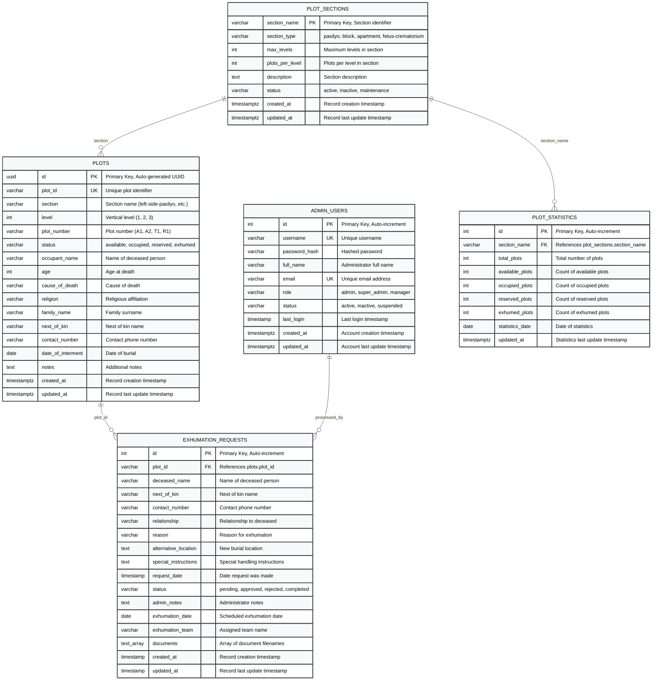

# Database Diagram - Cemetery Management System

## Overview
This Entity-Relationship Diagram (ERD) shows the database schema for the Cemetery Management System, following the traditional ERD notation with clear table structures and relationships.

## Database Technology
- **Database**: PostgreSQL (via Supabase)
- **Extensions**: UUID-OSSP for UUID generation
- **Indexing**: Optimized for common query patterns
- **Constraints**: Data integrity and validation rules

---

## Database Schema Diagram

---

## Table Descriptions

### PLOTS Table
The main table storing all cemetery plot information:
- **Primary Key**: `id` (UUID)
- **Unique Key**: `plot_id` (custom plot identifier)
- **Status Values**: available, occupied, reserved, exhumed
- **Indexes**: section, level, status, section+level
- **Triggers**: Auto-update `updated_at` timestamp

### EXHUMATION_REQUESTS Table
Stores exhumation requests and their processing status:
- **Primary Key**: `id` (auto-increment integer)
- **Foreign Key**: `plot_id` references `plots.plot_id`
- **Status Values**: pending, approved, rejected, completed
- **Indexes**: plot_id, status, request_date
- **Features**: Document storage array, team assignment

### PLOT_SECTIONS Table
Defines cemetery sections and their properties:
- **Primary Key**: `section_name`
- **Section Types**: pasilyo, block, apartment, fetus-crematorium
- **Properties**: max_levels, plots_per_level, description

### ADMIN_USERS Table
Stores administrator account information:
- **Primary Key**: `id` (auto-increment integer)
- **Unique Keys**: username, email
- **Roles**: admin, super_admin, manager
- **Security**: Hashed passwords, login tracking

### PLOT_STATISTICS Table
Maintains statistical data for each section:
- **Primary Key**: `id` (auto-increment integer)
- **Foreign Key**: `section_name` references `plot_sections.section_name`
- **Metrics**: Total, available, occupied, reserved, exhumed counts
- **Features**: Date-based statistics tracking

---

## Relationships

1. **PLOTS ↔ EXHUMATION_REQUESTS**: One-to-Many
   - A plot can have multiple exhumation requests over time
   - Each request is linked to a specific plot via `plot_id`

2. **PLOT_SECTIONS ↔ PLOTS**: One-to-Many
   - Each section contains multiple plots
   - Plots are organized by section name

3. **PLOT_SECTIONS ↔ PLOT_STATISTICS**: One-to-Many
   - Each section can have multiple statistical records
   - Statistics are tracked over time

4. **ADMIN_USERS ↔ EXHUMATION_REQUESTS**: One-to-Many
   - Administrators can process multiple exhumation requests
   - Tracks who processed each request

---

## Key Features

### Data Integrity
- **Foreign Key Constraints**: Maintain referential integrity
- **Check Constraints**: Validate status values and data ranges
- **Unique Constraints**: Prevent duplicate plot IDs and usernames
- **NOT NULL Constraints**: Ensure required fields are populated

### Performance Optimization
- **Indexes**: Optimized for common query patterns
- **Composite Indexes**: Multi-column indexes for complex queries
- **UUID Primary Keys**: Distributed system compatibility
- **Timestamp Tracking**: Audit trail for all records

### Security Features
- **Password Hashing**: Secure password storage
- **Role-Based Access**: Different admin permission levels
- **Audit Logging**: Track all data modifications
- **Session Management**: Secure authentication handling

---

## How to Use This Diagram

1. Copy the Mermaid code above
2. Go to https://mermaid.live
3. Paste the code into the editor
4. The diagram will render automatically
5. You can export as PNG, SVG, or PDF

This diagram follows the traditional ERD notation with:
- **Tables**: Represented as rectangles with table names
- **Primary Keys**: Marked with "PK"
- **Foreign Keys**: Marked with "FK"
- **Unique Keys**: Marked with "UK"
- **Data Types**: Specified for each column
- **Relationships**: Connected with lines showing cardinality

